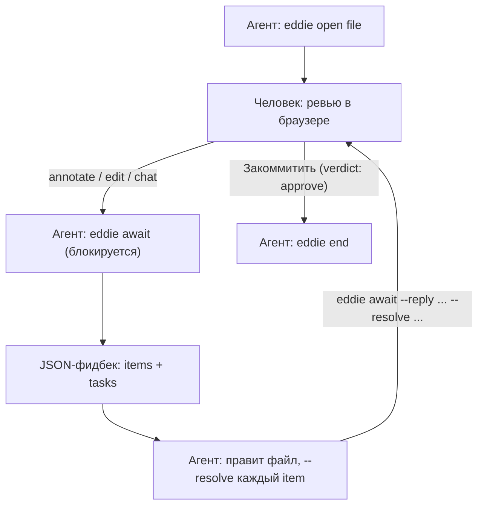
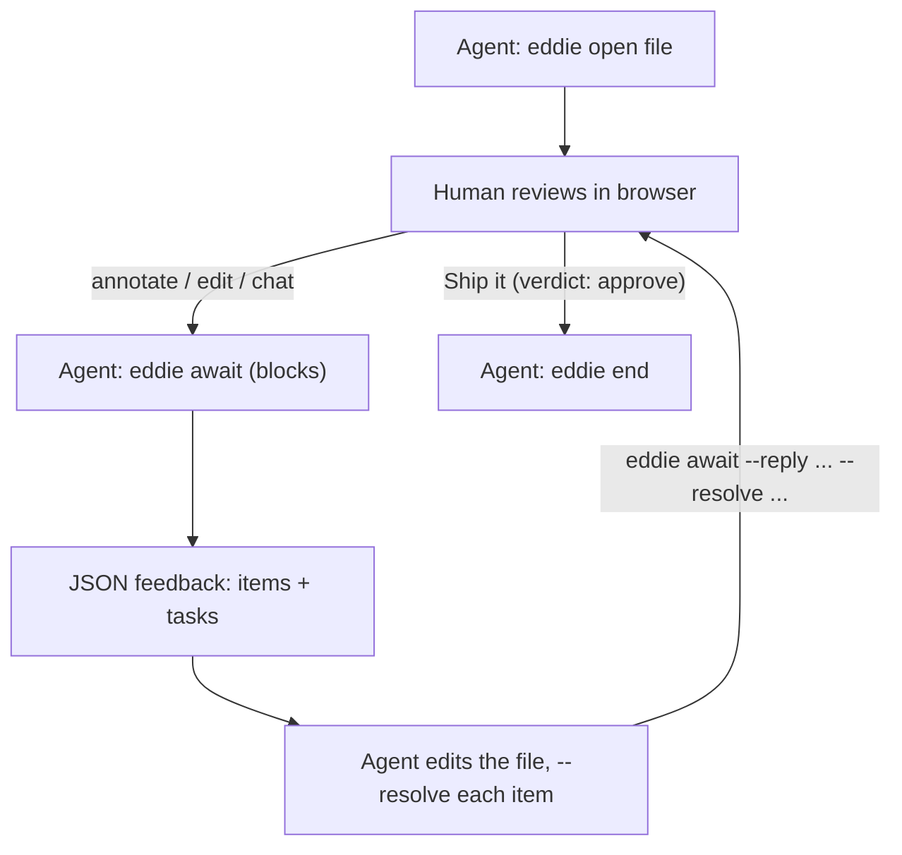

# Eddie

## Русский

**Что это.** Eddie — локальный браузерный канвас для ревью планов и
отчётов: агент открывает `.md`/`.html`-файл, человек комментирует, редактирует
текст прямо в браузере и жмёт «Отправить» (продолжить работу) или
«Закоммитить» (принято), а агент получает весь фидбек одним JSON-ответом на
блокирующий CLI-вызов. Работает без
внешних зависимостей — только Node.js и локальный HTTP-сервер на
`127.0.0.1`. Родился как отделившаяся и доработанная версия инструмента
`plan-canvas`.

### Быстрый старт

```bash
# Клонировать и запустить напрямую
git clone https://github.com/2dryhands/eddie.git
cd eddie
node eddie.js open plan.md

# Когда репозиторий станет публичным — без клонирования
npx github:2dryhands/eddie open plan.md
```

`open` возвращается сразу же и открывает файл в браузере. Дальше агент
вызывает `eddie await <file>` и блокируется, пока человек не отреагирует.

### Цикл ревью



### Протокол — коротко

`await` возвращает JSON с элементами четырёх видов: `chat` (сообщение),
`annotation` (комментарий, привязанный к элементу), `edit` (точная замена
текста `before → after`, применяется как есть) и `verdict`
(`approve` / `request-changes`). Пример ответа:

```json
{
  "status": "feedback",
  "items": [
    {
      "id": "fb-1",
      "kind": "edit",
      "anchor": { "selector": "p:nth-of-type(2)", "snippet": "Launch is planned for Q3" },
      "edit": { "before": "Q3", "after": "Q4" }
    },
    { "id": "fb-2", "kind": "verdict", "verdict": "request-changes" }
  ]
}
```

Каждый пункт (кроме `verdict`) — это задача, которую агент обязан закрыть
вызовом `eddie await <file> --resolve "fb-1:done:заменил Q3 на Q4"` с
честным статусом (`done` / `answered` / `declined`).

### Безопасность

Сервер слушает только `127.0.0.1` и отклоняет запросы с чужим `Host`/`Origin`
(защита от DNS rebinding). Просматриваемый артефакт рендерится в
sandboxed-iframe без `allow-same-origin` — скрипты внутри артефакта не
могут дотянуться до чрома канваса. Внешних зависимостей у пакета нет; Mermaid
подключается опционально с CDN (пиновая версия) и деградирует до показа
исходного текста диаграммы, если сеть недоступна — обзор никогда не
блокируется отсутствием интернета.

### Атрибуция и лицензия

Eddie извлечён и доработан из инструмента `plan-canvas` в
[everything-claude-code](https://github.com/affaan-m/everything-claude-code)
авторства Affaan Mustafa (MIT), который, в свою очередь, вдохновлён
[lavish-axi](https://github.com/kunchenguid/lavish-axi). Лицензия — MIT, см.
[LICENSE](LICENSE).

---

## English

**What it is.** Eddie is a local browser canvas for reviewing plans and
reports: an agent opens a `.md`/`.html` file, a human annotates it, edits
text directly in the browser, and hits Send (keep the loop going) or Ship it
(accepted), while the agent gets the entire round of feedback as one JSON
response from a single blocking CLI call. It has no external dependencies —
just Node.js and a local HTTP server on `127.0.0.1`. It started as a
spun-off, evolved version of the `plan-canvas` tool.

### Quick start

```bash
# Clone and run directly
git clone https://github.com/2dryhands/eddie.git
cd eddie
node eddie.js open plan.md

# Once the repo is public — no clone needed
npx github:2dryhands/eddie open plan.md
```

`open` returns immediately and opens the file in the browser. The agent then
calls `eddie await <file>` and blocks until the human responds.

### Review loop



### Protocol, briefly

`await` returns JSON with items of four kinds: `chat` (a message),
`annotation` (a comment anchored to an element), `edit` (an exact text
replacement, `before → after`, applied as-is), and `verdict`
(`approve` / `request-changes`). Example response:

```json
{
  "status": "feedback",
  "items": [
    {
      "id": "fb-1",
      "kind": "edit",
      "anchor": { "selector": "p:nth-of-type(2)", "snippet": "Launch is planned for Q3" },
      "edit": { "before": "Q3", "after": "Q4" }
    },
    { "id": "fb-2", "kind": "verdict", "verdict": "request-changes" }
  ]
}
```

Every item except `verdict` is a task the agent must close with
`eddie await <file> --resolve "fb-1:done:replaced Q3 with Q4"`, using an
honest status (`done` / `answered` / `declined`).

### Security

The server listens on `127.0.0.1` only and rejects requests with a
mismatched `Host`/`Origin` header (DNS-rebinding guard). The artifact under
review renders in a sandboxed iframe without `allow-same-origin` — scripts
inside the artifact cannot reach into the canvas chrome. The package has no
external dependencies; Mermaid loads optionally from a pinned CDN version
and degrades to showing the diagram's source text if the network is
unavailable — review is never blocked by a missing internet connection.

### Attribution and license

Eddie was extracted and evolved from the `plan-canvas` tool in
[everything-claude-code](https://github.com/affaan-m/everything-claude-code)
by Affaan Mustafa (MIT), itself inspired by
[lavish-axi](https://github.com/kunchenguid/lavish-axi). License: MIT, see
[LICENSE](LICENSE).
